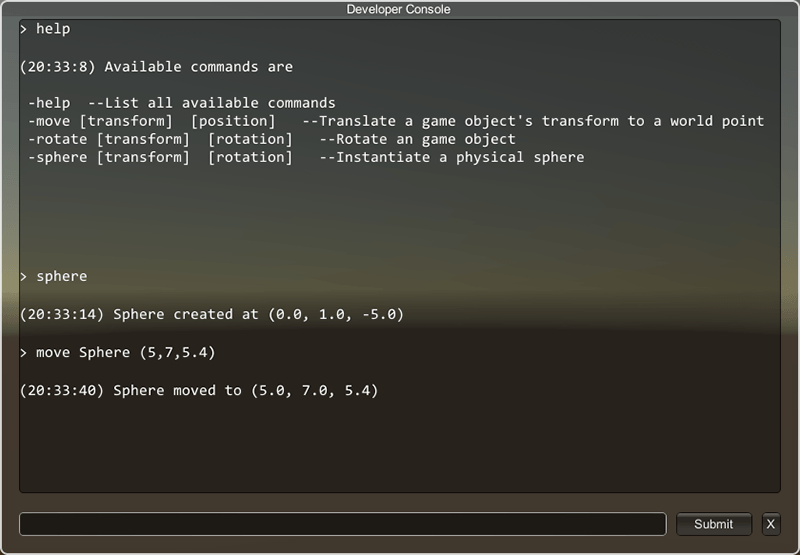
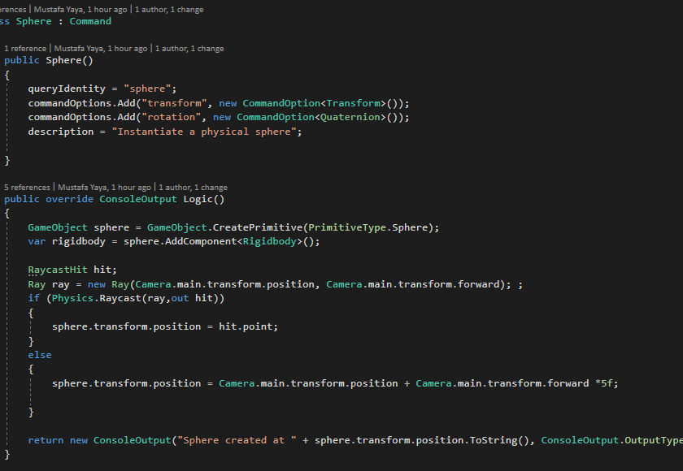

# Cesare 
### Simple Open Source Unity 3D Developer Console

Debug your build, create your own commands easily!



# Implementing to your project
1-[Download the latest version](https://github.com/mustafayaya/Unity-Developer-Console/releases) and import to your project.

2-Drag the "Developer Console" prefab to your scene.

3-Use  ```DeveloperConsole._instance.active``` boolean as open end.

Don't forget to reference  ```using Console;``` to your C# script.
It is ready to use!




# Creating commands
1-Create new class in Commands.cs which inherited from ```class Command```.

2-Set definiton of your new class and add query identity, description, command options global command variables .

3-Override  ```public ConsoleOutput Logic()``` method and add your command's logic here. Return output with a new  ```ConsoleOutput```.

4-Add your command class ```_commands.Add(new Help());``` to the list at ```public void RegisterCommands()``` method.

Your command is ready!

# Adding custom GUISkin
1-Drag your GUISkin to ```Style``` variable in DeveloperConsole.cs.

2-Make sure that you have a font on TextArea style or you will get error.


# Have a problem?
Ask in forum or [contact me.](mustafa.yaya@outlook.com.tr)
