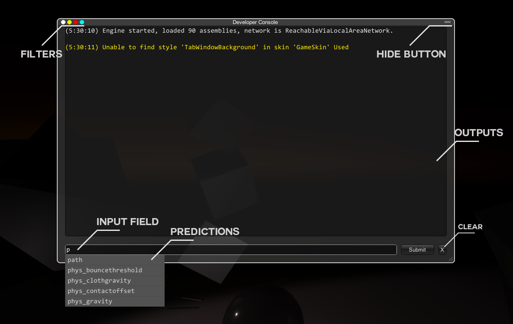
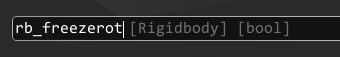
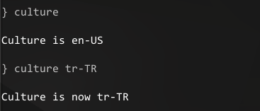
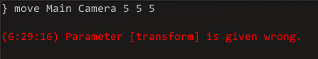
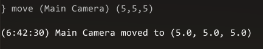

# Reactor Console 
### Debug your build, create your own commands easily.

So I was working for my souls-like game and I came up with this tool. I thought sharing with community would be useful. Thus I made simple revisions and I added useful commands that I needed when I was debugging & developing a product. 

# Implementing to your project
1-[Download the latest version](https://github.com/mustafayaya/Unity-Developer-Console/releases/latest) and import to your project.

2-Drag the "Developer Console" prefab to your scene.

Defaultly `F4` is gonna open the console. 

# Features
- Lean and resizeable user interface
- Powerful built-in commands
- Simple and modular command system
- Input predictions and hints
- Output filter system
- Input history system

# Anatomy

You can filter output at upper left corner. You can resize the window with the drag at the lower right corner. 

It will draw predictions with your input. You can navigate on predictions with  ` ↓ , ↑ ` keys. Submitted inputs can be restored later by pressing  ` ↑ ` .

# Console Syntax

Anatomy of provided input must be like this;

`[command] [params]`

Consider there are 2 invoke definitions `culture` &  `culture [CultureInfo]`. The first one prints the current culture and the second one changes it. Input must be;

Consider you need to move transform named Main Camera.

You have to use brackets for combining words.

# Adding new commands
Reactor console supports adding commands and parameters using attributes. There can be more than one invoke definitions for each command. Built-in commands are stored in `Commands.cs`.

For adding a new command you have to create a new class inherits from `Console.Command` and attribute it with `ConsoleCommand` attribute.

**NOTE: Do not forget to make parameter field public**

 	//Define command query identity, description and optionally for only developer version mode
   	[ConsoleCommand("culture", "Set the culture", true)]
	class CultureSet : Command]//Inherits class from Console.Command
        {
            [CommandParameter("CultureInfo")] //Add parameter for command
            public System.Globalization.CultureInfo value;
			
            public override ConsoleOutput Logic() //Virtual logic method for every command,
            {
                base.Logic();
                var cultureInfo = value;//Command logic
				
		//Return console output with message, output type and optionally time signature
                return new ConsoleOutput("Culture is now "+ cultureInfo, ConsoleOutput.OutputType.Log, false);

            }
        }

In this example we have set the current culture to provided CultureInfo by user. But what if user wants to print the current culture instead of changing it? We should move on to another invoke definition.

		 //We've added the same command again, but now there is no parameter. 
		 //Now user can type only "culture" to get culture information.
		 [ConsoleCommand("culture", "Get the culture")]
		class CultureGet : Command
        {
			//No parameters
            public override ConsoleOutput Logic()
            {
                base.Logic();
                var oldCulture = System.Globalization.CultureInfo.CurrentCulture.Name;

                return new ConsoleOutput("Culture is " + oldCulture, ConsoleOutput.OutputType.Log, false);

            }
        }

If there are two same invoke definitions(same query identity and same parameters) one of them will be ignored.

# Have a problem?
Search in repo wiki, ask in forum or [contact me.](mustafa.yaya@outlook.com.tr)

# Donations
I am a game developer and student. Feel free to donate and help me make living. =)

Branch name: İSTANBUL
IBAN: 1299-0576407
TR08 0006 4000 0011 2990 5764 07

